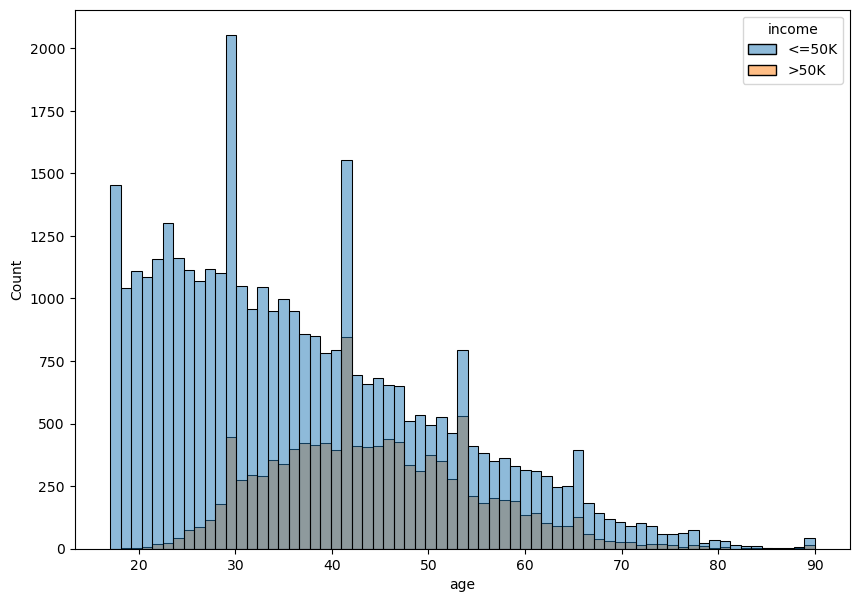

# Adult census income dataset
The goal is to predict whether income exceeds $50K per year based on census data.

## Key points of the project:
* Dataset overview and analysis
* Practice of creating various charts based on a dataset
* Dataset preprocessing (dropping unnecessary columns, filling missing values, standardization, encoding)
* Practice of using various ML algorithms (KNN, CART, ensembles, etc.) and ANN for classification
* An attempt was made to fit the ANN with balanced version of the data. This resulted in a equal accuracy scoring for each class (0.91, 0.65 vs 0.82, 0.83)
