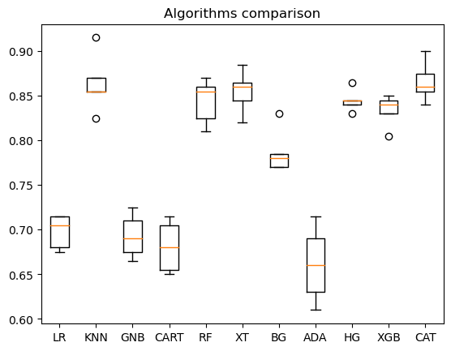
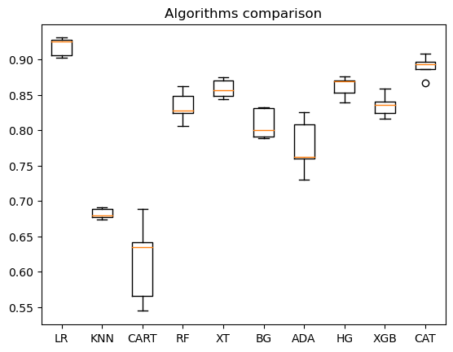

# Ensembles for classification & regression tasks
The ensemble algorithms are provided by Scikit-learn, CatBoost & XGBoost packages.\
The ensembles are showcased using synthetic datasets.\
Their performance is compared against "classic" ML algorithms (KNN, linear and logistic regression, etc.) and also against relatively simple ANN.
## Accuracy comparison (classification)

## R2 comparison (regression)

