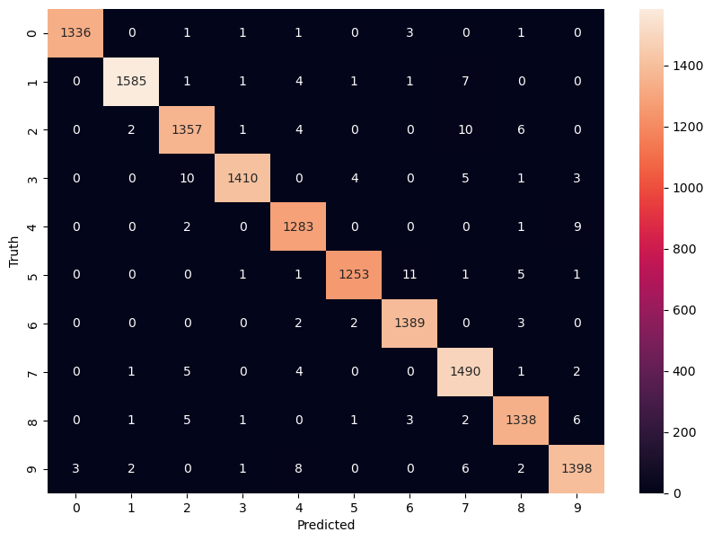

# Hand-written digits recognition

A test of various ML and DL models for MNIST digits identification.\
The best performer of all is the CNN trained on augmented versions of images (with rotation, zoom and range shift applied).

