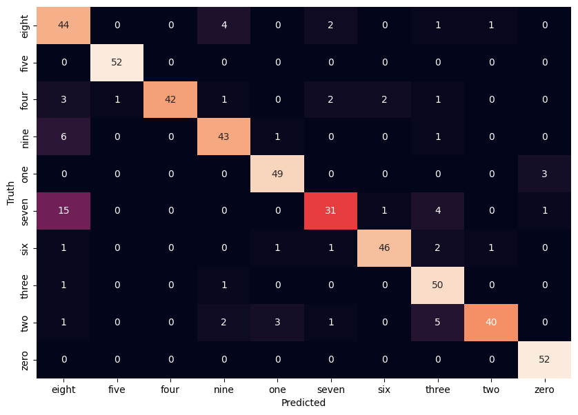
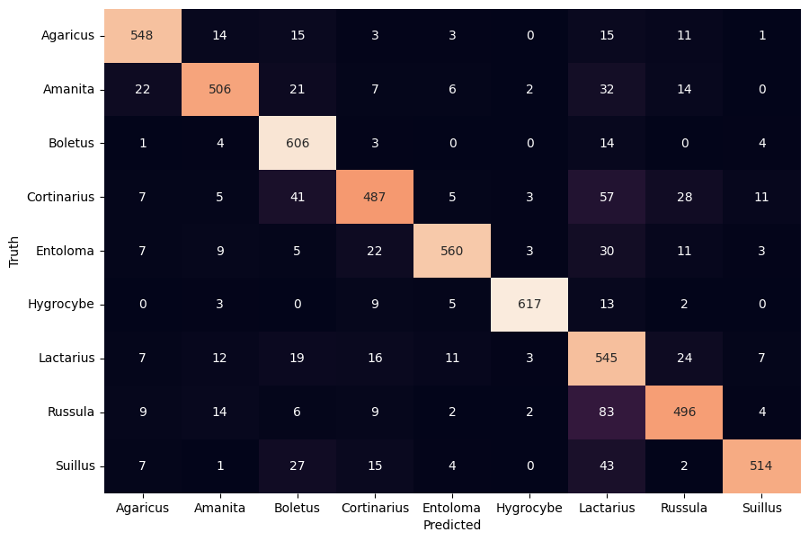

# Sign language digits classification (Keras & PyTorch)
This project utilizes the [sign language digits dataset](https://github.com/ardamavi/Sign-Language-Digits-Dataset) provided by Turkey Ankara Ayrancı Anadolu High School.\
It contains ~2000 RGB images (~200 for each digit) of size 100x100 pixels.\
The images were converted to a BW format because only the shape of each hand is analyzed.

Key steps of the project:
* Load images data in a black & white format
* Create augmentation layers for the data (including normalization)
* Create convolutional neural networks (using Keras & PyTorch) and train them using augmented data
* Run validation tests on the model using stock images from the Internet

Main conclusions:
* Models performance on test split of the dataset is ~0.8-0.9
* Models don't perform very well on images taken from different sources
* Presumably it can be fixed by adding more images from various places into training dataset i.e. by increasing model variance

Example of PyTorch model's confusion matrix on testing data:

# Forest mushrooms classification (Keras)
This project features the [MyShroomClassifier image dataset](https://universe.roboflow.com/myshroom-dataset-preprocessing/myshroomclassifier/dataset/1).\
In this dataset there are 9 classes of different mushroom genuses (Agaricus, Amanita, Boletus, Cortinarius, Entoloma, Hygrocybe, Lactarius, Russula, Suillus).

Key steps of the project:
* Remove all monochrome images from the dataset. The color of each type of mushroom is pretty important for a proper classification
* Add augmented images to the dataset in order to balance out data classes. After such manipulation dataset consists of ~23k images (or 2.5k for each class)
* Create CNN w/ augmentations and train it. Accuracy on test: ~0.75 (not very good)
* Create neural network w/ augmentations and transfer learning layers (VGG19), train the network for a while, unfreeze transfer layers and train the network again for a bit. Accuracy on test: ~0.85 (which is better)
* Validate both models using the images from the Internet (and also from cellphone camera). Sadly the results are not as impressing as during tests (~0.45 accuracy).

Main conclusions:
* Mushrooms of same kind can vary massively in shapes, sizes and colors
* For higher accuracy models need to be trained using much more data including pictures from different angles, in different time of day etc.

Example of transfer learning model's confusion matrix on testing data:

Examples of mushroom images classification:

