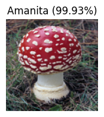
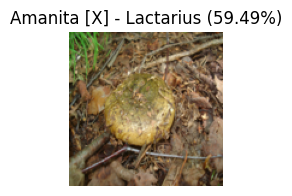
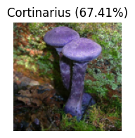
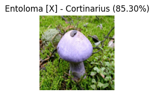
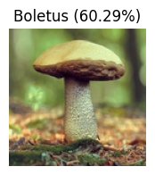
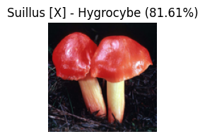
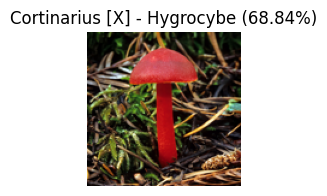

# Sign language digits classification (Keras & PyTorch)

The goal of this project is to build a model that is capable of classifying different hand gestures denoting digits from 0 to 9.

This project utilizes the [sign language digits dataset](https://github.com/ardamavi/Sign-Language-Digits-Dataset) provided by Turkey Ankara Ayrancı Anadolu High School.\
It contains ~2000 RGB images (~200 for each digit) of size 100x100 pixels.\
The images were converted to a black & white format because basically only the shape of each hand is analyzed, and not the color.

Key steps of the project:
* Load images data in a black & white format
* Create augmentation layers for the data (including min-max scaling)
* Create convolutional neural networks (using Keras & PyTorch) and train them using augmented data
* Run validation tests on the model using stock images from the Internet

Main conclusions:
* Models performance on testing data is ~0.8-0.9
* Models don't perform very well with images taken from different sources
* Presumably it can be fixed by adding more images from various places into training dataset i.e. by increasing model variance

Example of PyTorch model's confusion matrix on testing data:

# Forest mushrooms classification (Keras)

The goal of this project is to create a model for visual classification of different types of forest mushrooms.

This project features the [MyShroomClassifier image dataset](https://universe.roboflow.com/myshroom-dataset-preprocessing/myshroomclassifier/dataset/1).\
In this dataset there are 9 classes of different mushroom genuses (Agaricus, Amanita, Boletus, Cortinarius, Entoloma, Hygrocybe, Lactarius, Russula, Suillus).

Key steps of the project:
* Remove all monochrome images from the dataset. The color of mushrooms is pretty important for a proper classification
* Add augmented images to the dataset in order to balance out the classes. After such manipulation dataset contains ~23k images (or 2.5k for each class) of size 128x128x3
* Create CNN w/ augmentations and train it. Accuracy on test: ~0.75 (not very good)
* Create neural network w/ augmentations and transfer learning layers (VGG19), train the network for a while, unfreeze transfer layers and start training the network again. Accuracy on test: ~0.85 (which is better)
* Validate both models using the images from the Internet. Sadly the results are not as impressing as during tests (0.25 - 0.75 accuracy).

Main conclusions:
* Mushrooms of the same kind can vary massively in shapes, sizes and colors
* In order to achieve higher accuracy the models need to be trained using much more data including pictures from different angles, in different time of day etc.
* Based on this project I've created the [MyShroom-Classifier-App](https://github.com/Backgammonian/MyShroom-Classifier-App).

Example of transfer learning model's confusion matrix on testing data:

## Examples of mushroom images classification results:

