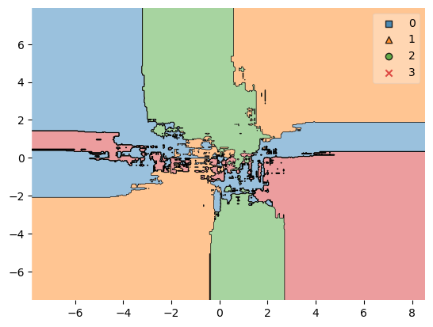

# PCA

This is an educational project to learn about PCA.

Principal component analysis (PCA) is a statistical technique used to transform a large set of correlated variables into a smaller number of uncorrelated variables called principal components.\
These new variables, which are linear combinations of the original ones, explain as much variability in the data as possible.\
PCA helps simplify complex multivariate data by reducing dimensionality and identifying underlying structures or patterns that may not be apparent from analyzing individual variables alone.\
It has various applications such as exploratory data analysis, pattern recognition, image compression, and more.

Key steps of the projects:
* Dataset preprocessing
* Training of two different neural networks using original and dimensionally reduced datasets in order to compare their performance
* When using MNIST dataset in both cases the accuracy metric stays the same (~0.96)
* When using synthetic dataset after applying PCA the accuracy metric drops dramatically (from ~0.92 to ~0.63)
* Decision region chart for synthetic dataset

