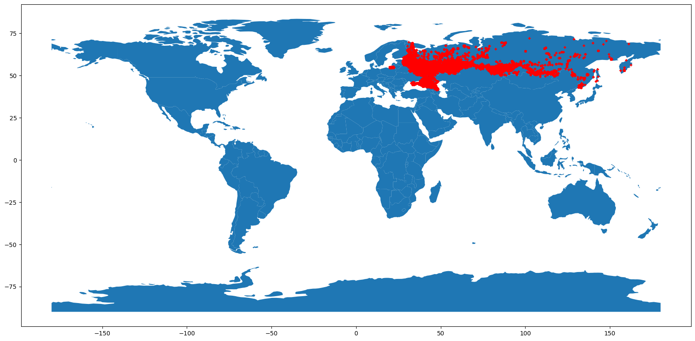

# Russian real estate price prediction

The goal of this project is to predict a price of a housing in Russia using information provided by [this Kaggle dataset](https://www.kaggle.com/datasets/mrdaniilak/russia-real-estate-20182021).

The key features of the project:
* Dataset lookup
* Charts showcase
* Housing locations showcase
* Dataset preprocessing (outliers removal, categorical encoding, standardization)
* Cross-validation using various ML algorithms (linear regression, CART, ensembles) and neural networks
* Comparison of different metrics (MAE, MSE, etc.)
* Test of predictions

Main conclusions:
* The performance of the models doesn't seem sufficient. This is mainly because I've used only a part of dataset in order to speed things up
* Cross-validation is a very useful tool and it can provide more reliable estimates of model performance than using only one train/test split

