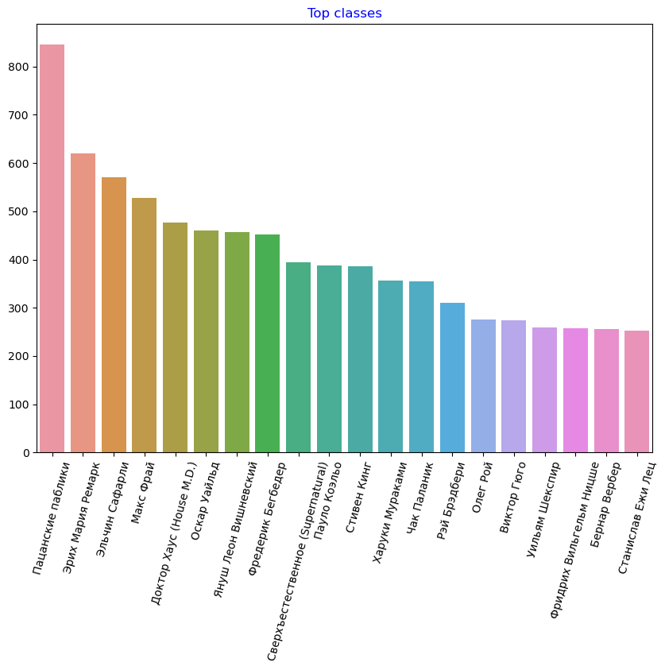

# Random Russian quotes generation (Keras)
This is an educational project of natural language generation.
The text dataset is composed of quotes parsed from [citaty.info](https://citaty.info/) site and [Russian "gang" quotes](https://www.kaggle.com/datasets/egoluback/russian-gang-quotes) from Kaggle.

Key steps of the project:
* Multithread Web-parsing of quotes in order to collect them in a single file
* Text data preprocessing and vectorization
* Building and testing of LSTM-based neural network for generating natural language based on specified input sentence

## Showcase of web-scraping results:

## Showcase of generated text (in Russian):

* Temperature: 0.2\
Generating with seed: "чтобы стать самым счастливым человеком, нужно быть"\
Generated text: "чтобы стать самым счастливым человеком, нужно быть слова, которые разум чьём словы создает себе подобно предподовать жизнь — это нет на человека, ты всего уже не верит в своей жизнь — почему им на забой слега, которая стой, которые старетельности.
 — не станение.
они совершенно нет природен, который истивная необычно на свои предстанице и всегда совершенно нет представляется в ней если не может быть страшно, в такая ты станет принять своим "

* Temperature: 0.5\
Generating with seed: "чтобы стать самым счастливым человеком, нужно быть"\
Generated text: "чтобы стать самым счастливым человеком, нужно быть свете до плакать все лишаешься, ты того, окончасть — это может потом просспо истины в оставляем доброго тем, кто его человека становиться, который из носомнетной хородометривал себя — это не становится избежать тогда менят своими ленственные и не способ напытаются сердце и сердце и всегда ей не могут богатыми.
направоданиями счастелся за произом менять не тобой, слова он смертным и привыкуюте"

* Temperature: 1.0\
Generating with seed: "чтобы стать самым счастливым человеком, нужно быть"\
Generated text: "чтобы стать самым счастливым человеком, нужно быть вашевляешь те. — а всех «встречивая сдиволюдривки ложе с вам ляжий и даже важно, хотеля один исторого — людвин застранием загац, маналала: «тор, ни зачем подыбать его, томам. поднятые счастливая шоговпечении ненавлей.
аспехимой строитично, всегда любовь, а он и врага для смерти». насторовом обгановать на судьст вопрезятный пронций сам глупые тываются себя благодара... я не нужно радо сопроща"

* Temperature: 1.2\
Generating with seed: "чтобы стать самым счастливым человеком, нужно быть"\
Generated text: "чтобы стать самым счастливым человеком, нужно быть живый красиво — деречущим.
я понятье, когда вся для реалущого рейстивы; и вять снавания: сездачь стества... мое оделое. отогда сумешься.
что застанись вотное релит.
у кручаем жизущким вядолет. смиранные и бердуевствий женщине все будет, же травают себя он моворостивля зо преупесным все занямение,  — сколько с делее? — бугу. значин: как застаневием и ожидека живощность таково), кто из-зро.
след"

