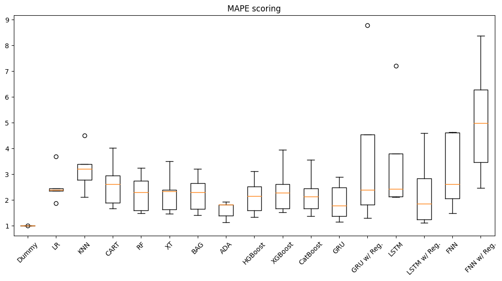

# Time series forecasting

The main goal of these projects is to learn about time series forecasting techniques.\
The difference between regression analysis and time series forecasting is the ordering of data along the time axis.\
It means that ML & DL algorithms should learn not just patterns from the data but also trends, seasonality and cyclicity of time series.

## Weather temperature prediction

An attempt to predict weather temperature using its historical values and seasonality.\
The data is provided by [weather dataset](https://www.kaggle.com/datasets/muthuj7/weather-dataset) from Kaggle.

The key steps of the project:
* Dataset lookup & visual analysis
* Autocorrelation & partial autocorrelation charts
* Preprocessing (index sorting, filling missing values)
* Time features engineering
* Cross-validation for time series using ML & DL regression models (including NNs with recurrent layers)

Main conclusions:
* Ensembles & neural networks perform very well on this dataset (according to MSE, RMSE, MAE, R2 metrics)
* I've noticed that dummy regressor (basically just a straight line) gives the best MAPE result compared to the rest of models what is kind of strange. Maybe because it's the mean value of the testing data?

## Hourly energy consumption prediction

The prediction of electricity consumption of PJM West.\
The data is provided by [hourly energy consumption dataset](https://www.kaggle.com/datasets/robikscube/hourly-energy-consumption) from Kaggle.

The key steps of this project are the same as above but with addition of one step:
* Cross-validation for time series using ML & DL *classification* models i.e. prediction of whether the value of the target variable will go up or down

## Russian day-ahead wholesale electricity market price forecasting

Attempt to use regression and ML algorithms in order to accurately predict the future hourly values of electricity price of Russian wholesale day-ahead electricity market on 2nd price zone.\
The data is provided by the [administrator of the trading system (rus. АО «АТС»)](https://www.atsenergo.ru/results/rsv/index?zone=1)

The key steps of the project:
* Data parsing
* Index preprocessing & time features engineering
* Dataset lookup & visual analysis
* 10-fold time series cross-validation

Main conclusion:
* Popular ML models can't accurately predict prices of Russian day-ahead electricity market because of high variance. Also regression models can't give accurate prediciton because of high bias. 
* Further investigation of the topic of accurate electricity price forecasting is needed.

